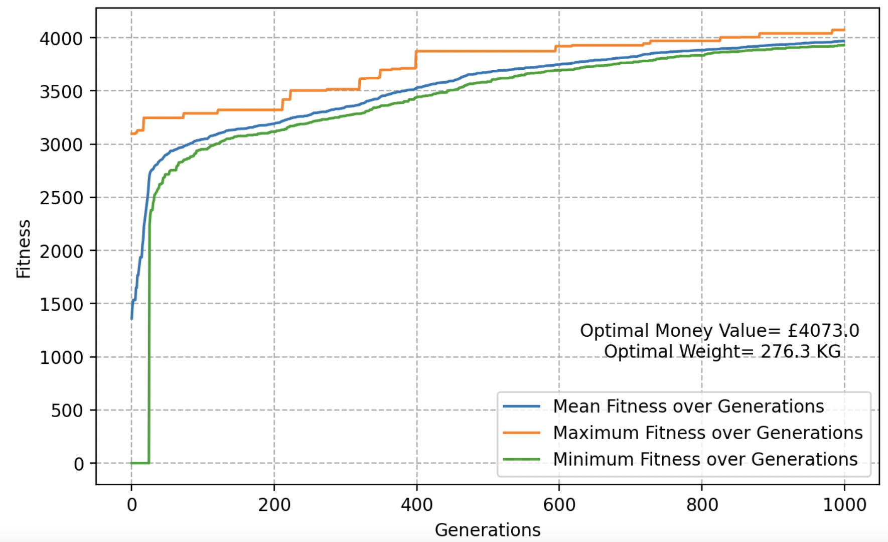

# Girish's Portfolio

  
  

I am Girish and currently pursuing MSc Data Science with AI at University of Exeter, UK. I am a data enthusiast and below is a list of some projects I undertook.

# Project 1: Knapsack Problem using Evolutionary Algorithm 

  * Developed and used Evolutionary Algorithm to optimize and study The Knapsack Problem.
  * Followed EA regime of Selection, Crossover, Mutation and replacement of weekest in population.
  * Performed a series of experiments and evaluations using different components of EAs like mutation, crossover, population size and tournament selection.
  * Checkout the project code and detailed description on Github
  
  
# Project 2: Tweets-Analysis, March 2020 - Europe

  * Explored a large dataset of tweets collected from the twitter API during the period March 1st to March 31st 2020
  * Sampled and worked with around 100 GB data
  * Performed some Basic Stats, analyses and Data lookup
  * Created Interactive clustered Maps from geo-tagged tweets with functionality to read tweets by clicking on map markers
  * Analysed users and automated accounts
  * Identified unusual days and events in UK and Ireland
  * Checkout the project code and detailed description on Github
  
  
  

# Project 3: Malaria Cells Classification

  * This project uses the Machine Learning algorithms like K-Nearest Neighbors and implements a deep learning- Convolutional Neural Network with tensorflow using       keras API.
  * Classifies cell images as infected or not infected.
  * The images were labelled as class 0 and 1 signifying uninfected and infected, followed by resizing, shuffling and visualisation.
  * Trained and tuned hyperparameters of a KNN classifier using n-fold cross validation.
  * Trained and tuned hyperparameters of a Convolutional Neural Network and experimented with different components.
  * Performed evaluations on both algorithms.
  * Checkout the project code and detailed description on Github
  
  
# Project 4: ECMM447: Networks-Analysis 

  * Coursework under ECMM447 - Social Networks and Text Analysis at University
  * This coursework utilises the dataset from Enron communication network
  * Performed Network Analysis - Adjacency Matrix, Degree Distribution, Hypothesis Testing - Lognormal Distribution, Assortativity and Disassortativity.
  * Performed Community Detection and checked network centrality.
  * Performed Compartmental Modelling and simulation of Disease Spread using SI and SIR models
  * Checkout the project code and detailed description on Github
  
